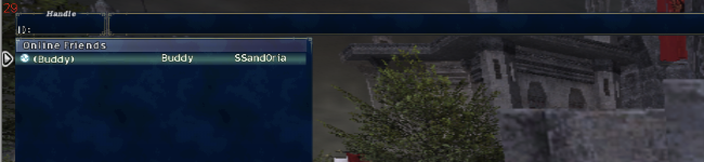

# FFXI Native Friend List

Final Fantasy XI's **own** Friend List menu, working on LandSandBoat private servers. This isn't
an overlay: the real menu opened by `/friendlist` shows your friends in its native Online, Offline,
and Pending categories, with the character name and current zone that the client renders itself.
The menu updates live when friends log in or out.



Verified 2026-09-12 with two real characters on a local LandSandBoat server. The request,
accept, online, logout, login, remove, and re-request flows were all checked in the native menu
(see [docs/VERIFICATION.md](docs/VERIFICATION.md)).

## How it works

The retail client ships the whole feature: the commands, the menus, and the category layout.
On a private server it's empty because every entry is fetched from PlayOnline, which no longer
exists. So:

| Piece | What it does |
|---|---|
| `addon/nativefriends` (Ashita v4) | Redirects FFXiMain's per-slot friend fetch to a buffer it fills with correctly laid-out 0x100-byte entries, then calls the menu's own rebuild routine so changes appear live. Hook sites are found by byte signature. |
| `server/friendsd.py` | Small HTTP service that runs beside the LSB database. It stores friendships in its own `nf_friends` table and reads presence from LSB's `accounts_sessions`. |
| `tools/headless_friend.py` | Logs a second character in with LSB's HeadlessXI, so two-player tests need only one game client. |

How the client internals were found, with every address and field: [docs/CLIENT_INTERNALS.md](docs/CLIENT_INTERNALS.md).

## Install

**Server operator** (next to your LSB database):

```sh
pip install pymysql
XI_DB_USER=xiuser XI_DB_PASS=... python3 server/friendsd.py --bind 0.0.0.0 --port 54290
```

Don't use ports 54001, 54002, 54230, or 54231. LandSandBoat's lobby, search, and login servers
use them, and on localhost a second listener on 54230 intercepts game logins.

**Player:**

1. Copy `addon/nativefriends` into `Ashita/addons/`.
2. If your server isn't local, create `addon/nativefriends/settings.txt` containing `url=http://your-server:54290`.
3. Run `/addon load nativefriends` (or add it to your Ashita script).
4. Unload any other addon that claims `/befriend`, such as FFXIFriendList, because it swallows the command first.

## Commands

| Command | Effect |
|---|---|
| `/friendlist`, `/flist` | Open the native menu (native behaviour; the addon refreshes its data first) |
| `/befriend <name>` | Send a friend request (mutual consent, as on retail) |
| `/friendlist accept <name>` / `decline <name>` | Answer a request |
| `/friendlist remove <name>` | Remove a friend from both lists |
| `/friendlist status` / `refresh` / `server <url>` | Diagnostics |

Chat notices match the retail wording: "X has logged in.", "X would like to add you as a friend.", and so on.

## Security

`friendsd` only acts for a character that is logged in to the map server from the requesting IP
address. By default it trusts `127.0.0.1` (the local single-machine setup); use
`--no-trust-local` on shared hosts. A pending request never reveals the other player's presence.

## Status and next steps

See [docs/ROADMAP.md](docs/ROADMAP.md) for known gaps (the menu's own Add/Remove submenu, job
display, message-of-the-day) and the continuation pathways, including a native LSB module.

---
Copyright (c) 2026 Daniel Bates / Bates LLC. All rights reserved. PolyForm Noncommercial 1.0.0
with a 10% commercial revenue rider ([LICENSE](LICENSE)). https://batesai.org · help@batesai.org
